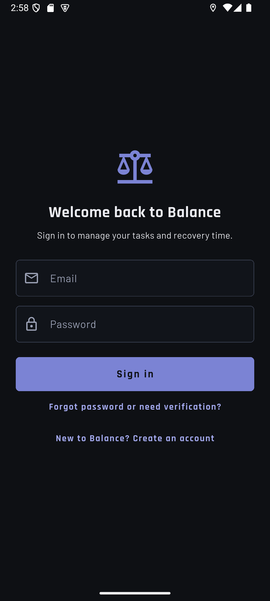

# Balance user guide for judges

This guide takes about 10 minutes. It assumes no help from the team.

> **Screenshots:** each step has a placeholder ``. Replace them
> with phone screenshots taken on the judge account (default font size, no personal data).

## Before you start

| You need | Where to get it |
| --- | --- |
| An Android phone (Android 7.0 or later) with internet | — |
| The Balance APK | [Latest release](https://github.com/aronlim47-maker/balance/releases/latest) → `app-release.apk` |
| The judge account email and password | Supplied in our submission form. They are never stored in this repository. |

The bottom bar has five pages: **TODAY**, **QUESTS**, **COUNCIL**, **SANCTUARY** and
**JOURNEY**. Each page shows a practical name together with its RPG label, for example
*Workload Overview · World Status*.

## 1. Install and sign in

1. On the phone, open the release link and download `app-release.apk`.
2. Open the file. If Android asks, allow installing apps from this source, then tap
   **Install**.
3. Open **Balance**, enter the judge email and password, and tap **Sign in**.

If you see a "Local preview" banner, you installed a development build; use the APK
from the release page instead.

## 2. Detect: see the overload (TODAY)

The judge account has a prepared sample evening.

1. **Time capacity** shows **300 minutes planned** against **180 minutes available**:
   a **120-minute overload**.
2. **World Status** shows five bars in this order: **Mental, Time, Physical, Social,
   Errands**. A bar with no data says **Unknown**; Balance never treats missing data as
   zero.
3. Optional: the daily review asks for energy and hours of rest. **Save review** or
   **Skip for now**; skipping has no penalty.

## 3. Look at the tasks (QUESTS)

1. Each task shows its category (Study, Errand, Social, Exercise or Other), its
   flexibility (Fixed, Flexible or Needs agreement) and whether it is **Protected**.
2. Protected commitments, such as a work shift, family duty or sleep minimum, are never
   moved to make a plan fit.
3. Optional: tap **Add task** to see that a category is required before saving.

## 4. Decide: compare and confirm a plan (COUNCIL)

1. Open **COUNCIL**. The page states: *Suggestions only. Nothing moves until confirmed.*
2. Each option shows what moves, what stays **Protected**, the **Cost** on another day,
   the **Room created** and anything to **Check before confirming**.
3. Tap **Compare plans** to see options side by side.
4. Choose a plan and tap **Confirm selected plan**, then confirm the move in the final
   preview.
5. The plan-updated screen lists every task that moved and what stayed protected. Tap
   **Return to Today** and use the date arrows to see the moved work on its new day.

## 5. Undo the plan

1. Open **COUNCIL** and tap the **Plan history** icon (clock) at the top.
2. Open the plan marked **Confirmed** and tap **Undo this plan**. The history now marks
   it **Undone**.
3. On **TODAY**, the original 120-minute overload is back.

Please undo every plan you confirm, so the sample day stays ready for the next judge.

Undo is refused, with an explanation, if the tasks were changed after the plan was
confirmed; it never overwrites later edits.

## 6. Recover: protected rest (SANCTUARY)

1. **SANCTUARY** shows the protected recovery slot from the sample evening.
2. To add one yourself, tap **Add recovery time**, choose a time inside the day's
   available time, and tap **Save**. An activity is optional; the slot holds either way.
3. If no available time exists that day, the app explains this and offers **Go to Today**.

Marking an activity done does not change the workload scores: resting is not graded.

## 7. Reflect: weekly summary (JOURNEY)

1. **JOURNEY** shows a private weekly summary. Days without records say "No record"; past
   scores are never invented.
2. Tap **Add optional reflection**, write a sentence and **Save**.
3. The **Achievements** section lists seven cards with their unlock conditions. Earned
   ones show the award date. **Team Coordination** stays **Locked**: it needs shared
   tasks, which are a future version.

## If something goes wrong

| What you see | What to do |
| --- | --- |
| "Could not connect" with **Try again** | Check the internet connection, then tap **Try again**. Data already shown stays on screen. |
| Today shows no overload | Another judge may have changed the sample day. Use the date arrows to find the sample date, or contact the team. |
| Sign-in fails | Check the email and password from the submission form for typing errors. |

## Known limitations

- Android only. The web build is not part of this submission; iOS was not device-tested.
- Every task needs a deadline; there is no "No deadline" option yet.
- Team Coordination achievement and shared tasks are not available yet.
- Balance is a planning aid, not a medical or mental-health tool.
