# Balance — User Guide for Judges

Balance helps a university student whose plan no longer fits the day. It shows how far
the day is over capacity, compares safe ways to fix it, changes nothing until the student
confirms, protects real free time for rest, and lets the student reflect privately.

**Time needed:** about 15 minutes for the full walkthrough. **Help needed:** none.

This guide has three parts:

- **Part A — Walkthrough (steps 1–8):** do these in order to see the whole journey.
- **Part B — Page reference:** every button and label on every page, for checking details.
- **Part C — Glossary, privacy, troubleshooting and limitations.**

> **About the screenshots.** They were taken on a team test account that holds the same
> sample data as the judge account, on a day called *Sunday 11 October*. On the judge
> account the sample day is **Sunday 1 November 2026**; everything else looks the same.

---

# Part A — Walkthrough

## Quick path

| Step | Page | What you will do | Time |
| --- | --- | --- | --- |
| 1 | — | Install, sign in, read the three-page introduction | 2 min |
| 2 | TODAY | See a 2-hour overload, the day's free time and tasks, and five workload bars | 3 min |
| 3 | QUESTS | Open the two tasks behind the overload | 1 min |
| 4 | COUNCIL | Read the suggested fix and confirm it | 2 min |
| 5 | COUNCIL | Check the result, then undo the plan from Plan history | 2 min |
| 6 | SANCTUARY | Protect 30 minutes of rest from a suggested free time, then remove it | 2 min |
| 7 | JOURNEY | See the weekly summary, the achievement wall and a new badge | 2 min |
| 8 | PROFILE | Optional: sound, reminders and overload alerts | 1 min |

## Before you start

| You need | Details |
| --- | --- |
| An Android phone | Android 8.0 or later, with internet. |
| Malaysia time on the phone | Settings → System → Date & time → use automatic time zone. Balance shows times in the phone's time zone. |
| The Balance app | [Latest release](https://github.com/aronlim47-maker/balance/releases/latest) → download `app-release.apk`. |
| The judge account | Email and password are in our submission form. They are never stored in this repository. |
| The sample day | **Sunday 1 November 2026.** On that date Balance opens directly on it. |

**Shared account.** All judges use the same account. Please undo any plan you confirm and
remove any recovery time you add (steps 5 and 6), so the next judge sees the same day.

## Step 1 — Install, sign in and read the introduction

1. On the phone, open the release link and download `app-release.apk`.
2. Open the downloaded file. If Android asks, allow installing apps from this source, then
   tap **Install**. If an older Balance build is installed, uninstall it first.
3. Open **Balance**. Enter the judge **Email** and **Password** and tap **Sign in**.
   *Forgot password or need verification?* and *Create an account* are not needed.
4. The first time, a three-page introduction appears: **Detect**, **Decide** and **Recover
   and reflect**. Read each page and tap **Next**, then **Get started**. **Skip** closes it at
   any time. You can reopen it later from **Profile → How Balance works**.

 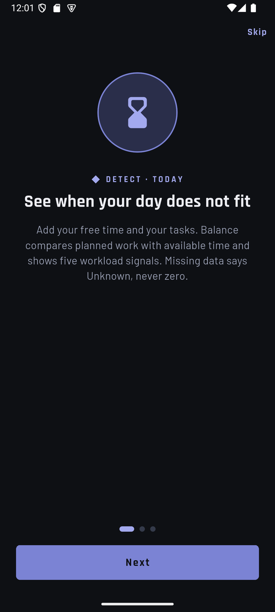 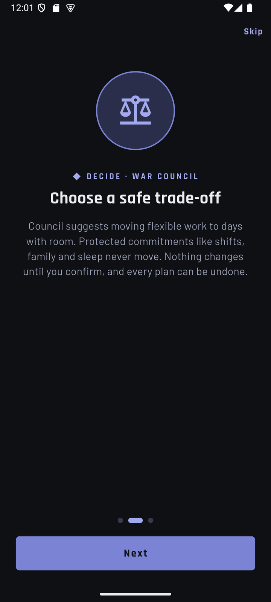 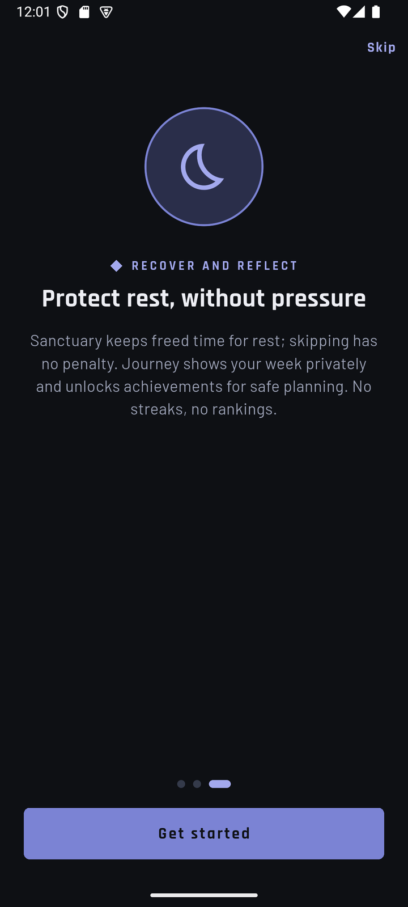

You now see the **TODAY** page. If a yellow "Local preview" banner appears, this is not the
release build; reinstall from the release link.

## Step 2 — See the overload (TODAY)

**What you see first.** The top of Today answers one question: *does the day fit?*

1. If the date under **TODAY** is not the sample day, tap the **→** (Next day) arrow until it
   is. The middle label says *Viewing today*, *Viewing tomorrow* or the date.
2. **Time capacity** shows **3h available** and **5h planned**. The bar shows the part that
   fits (blue) and the part beyond capacity (red). The red tag says **2H OVER**.
3. Below it, the red **Capacity gap** card states the consequence: *120 minutes must be
   moved, reduced or recovered.* When a day fits, this card is green and says **Plan is
   balanced** instead.
4. The badge at the top right, **LOAD: BUILDING** (or Low, High, Over capacity), summarises
   the five workload bars further down. It is about workload, not about whether time fits.

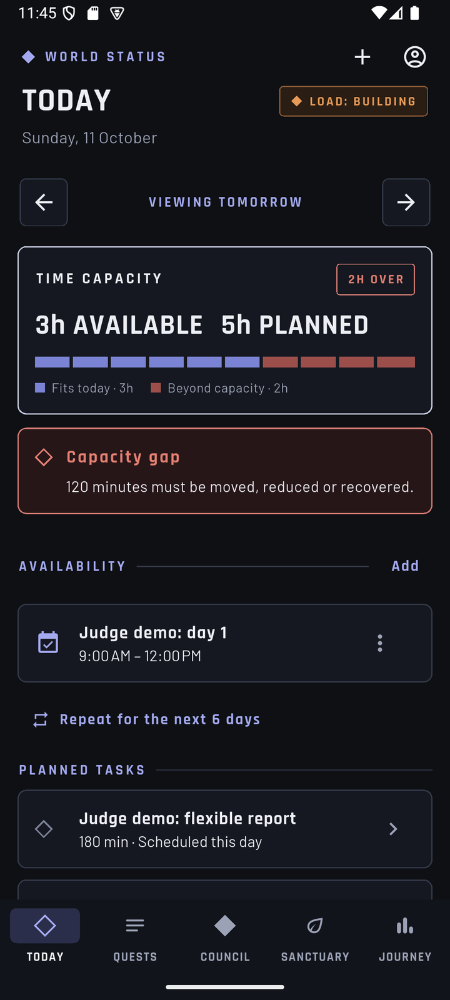 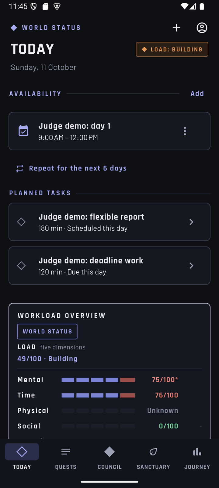

**The day's time and work.** Scroll down a little.

5. **Availability** lists the free time on this day: *Judge demo: day 1, 9:00 AM – 12:00 PM*.
   - **Add** (or **+** at the top) adds another time block.
   - The **⋮** menu on a block offers **Edit** and **Delete**.
   - **Repeat for the next 6 days** copies this day's time to the coming days. An empty day
     shows **Copy from** *(previous day)* instead. **On the shared judge account, please
     only look at these two buttons**, so the sample week stays the same.
6. **Planned tasks** lists what counts on this day: *Judge demo: flexible report* (180 min,
   scheduled this day) and *Judge demo: deadline work* (120 min, due this day). Tap a task to
   see why it counts on this day.

**The five workload bars.** Scroll further.

7. **Workload Overview · World Status** shows the **Load** total (for example *49/100 ·
   Building*) and five bars in a fixed order: **Mental, Time, Physical, Social, Errands**.
   - Each bar is a score from 0 to 100; higher means more planning pressure.
   - A bar with no data says **Unknown**. Balance never treats missing data as zero.
   - An asterisk (\*) after a score means it is partial: some of its inputs are unknown.
   - **▲ / ▼** next to a bar shows its change since yesterday (▲ more pressure, ▼ less),
     only when the previous day also has a record. A dash means no change.
   - **Calamity · workload trend** says *Rising*, *Stable*, *Easing* or *Not enough history*.
8. Tap **How is this calculated?** to open one line per bar: the score and its main reason
   (for example *Time · 76/100 — 300 min planned; 180 min available*). Tap a bar's line for
   the full breakdown. The last line reminds you that this is a planning aid, not a health
   assessment.

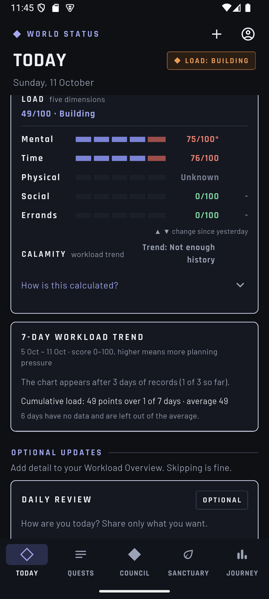 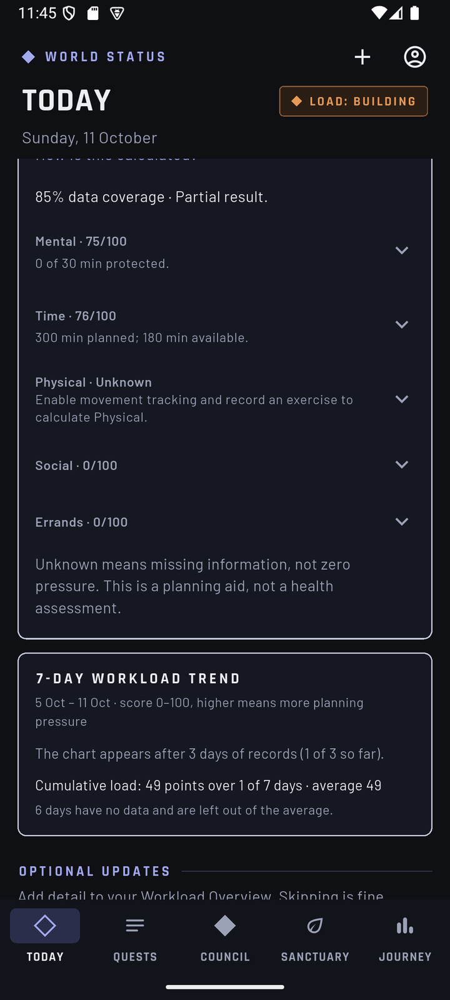

**Optional updates.** At the bottom of Today.

9. **7-day workload trend** shows each day's total once at least three days are recorded;
   before that it says how many days are recorded so far. Missing days are never invented.
10. **Optional updates** add detail to the workload bars. Skipping them has no penalty.
    - **Daily Review** — *Add review* asks for mental energy, physical energy and hours of
      rest; **Skip for now** is always available.
    - **Movement** — *Track movement* turns on the Physical bar, with a preferred interval
      and *Record exercise*.
    - **Social** — expand it to add a social event or mark *No commitments this week*.

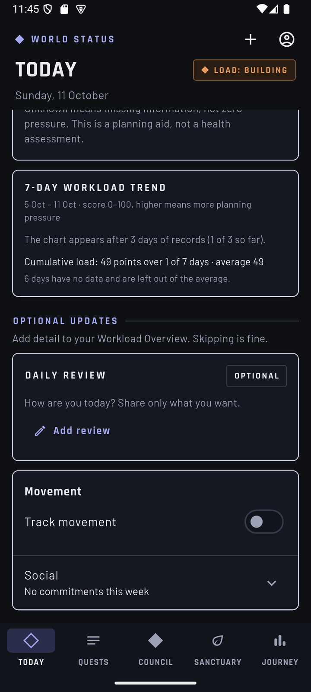

## Step 3 — Look at the tasks (QUESTS)

1. Tap **QUESTS** in the bottom bar. The page title is **TASKS** (*Quest Board*), with a count
   such as *2 entries · 0 protected*.
2. The sample tasks are below. Together they need 5 hours, but the sample day has only
   3 hours free.

| Task | Length | Scheduled | Deadline |
| --- | --- | --- | --- |
| Judge demo: flexible report | 3h | 9:00 AM – 12:00 PM on the sample day | The next day, 5:00 PM |
| Judge demo: deadline work | 2h | Not scheduled | The sample day, 5:00 PM |

3. **Tap a task card** to open its details: remaining time, due date, scheduled time,
   category, flexibility and status, with an **Edit task** button.
4. Optional: tap **+** to see the new task form, then close it without saving. A task needs a
   **Title**, **Estimated minutes**, **Due date and time** and a **Task category**; the form
   explains each category. **Flexibility** (Flexible, Fixed, Needs agreement), **Protected
   task**, **Optional task** and **Schedule work time** are set here too.

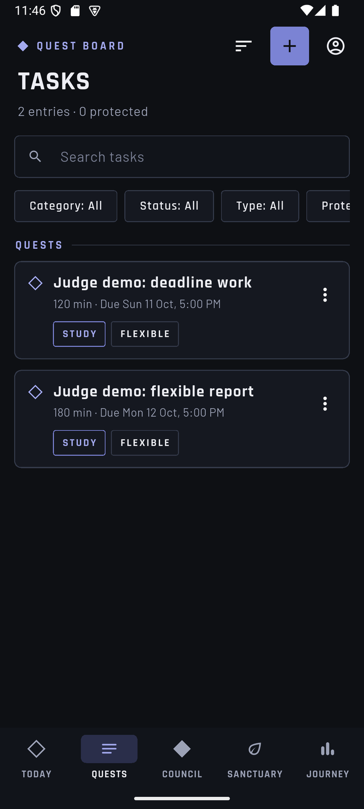 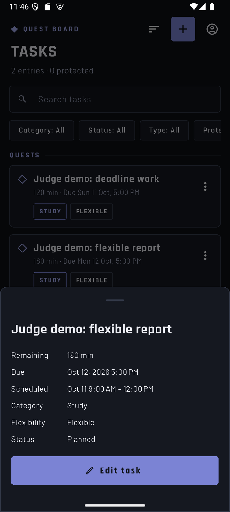 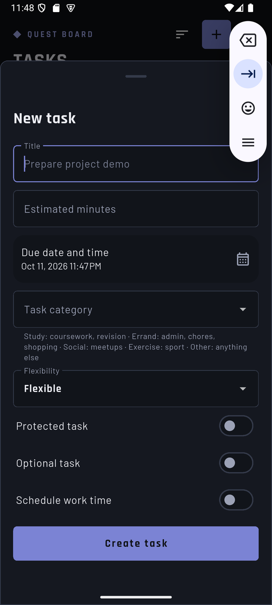

## Step 4 — Read the suggested fix and confirm it (COUNCIL)

1. Tap **COUNCIL**. The page is **COMPARE PLANS** (*War Council*). Use the arrows so the date
   reads the sample day.
2. The top repeats the problem: **Over capacity**, **300 MIN planned → 180 MIN available**,
   *Capacity gap: 120 minutes*. **What stays protected** lists anything Council will never
   move (none on the sample day). The tag **FEASIBLE** means at least one safe option exists.
3. Under **Choose a plan** — *Suggestions only. Nothing moves until confirmed.* — the option
   reads **Move Judge demo: flexible report to** *(the next day)*: *Move 120 minutes, 9:00
   AM – 11:00 AM, before the deadline.* Tap **See trade-offs** on the card to read the cost on
   the next day, what stays protected, the room created and anything to check.
4. Tap the option to select it (it shows **SELECTED**), then tap **Confirm selected plan**.
   The plan is saved at once; the server checks every rule again before saving. A soft chime
   plays if sound effects are on.
5. **Plan confirmed** lists what moved and offers **Undo this plan** and **Return to Today**.

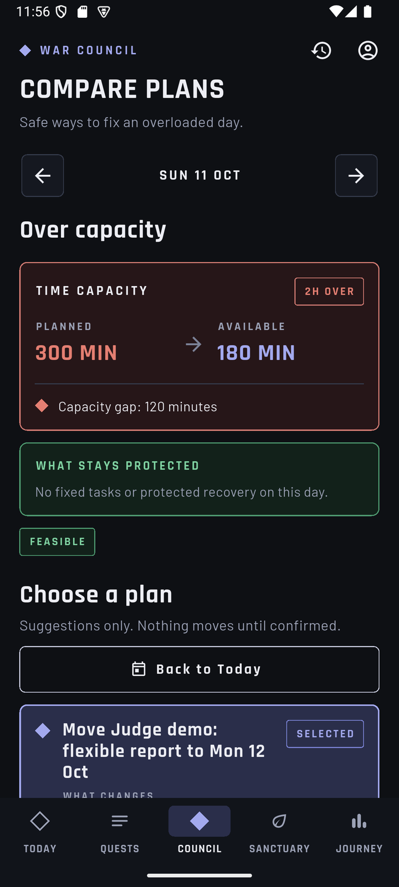 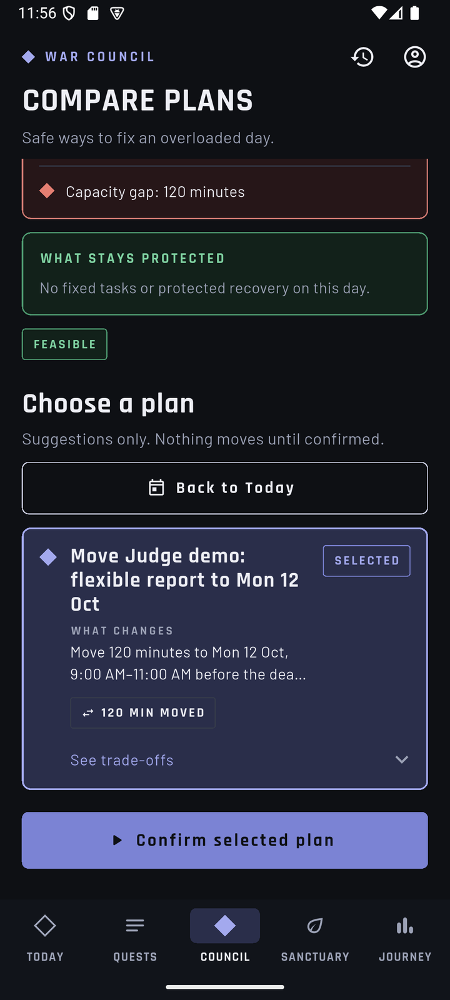 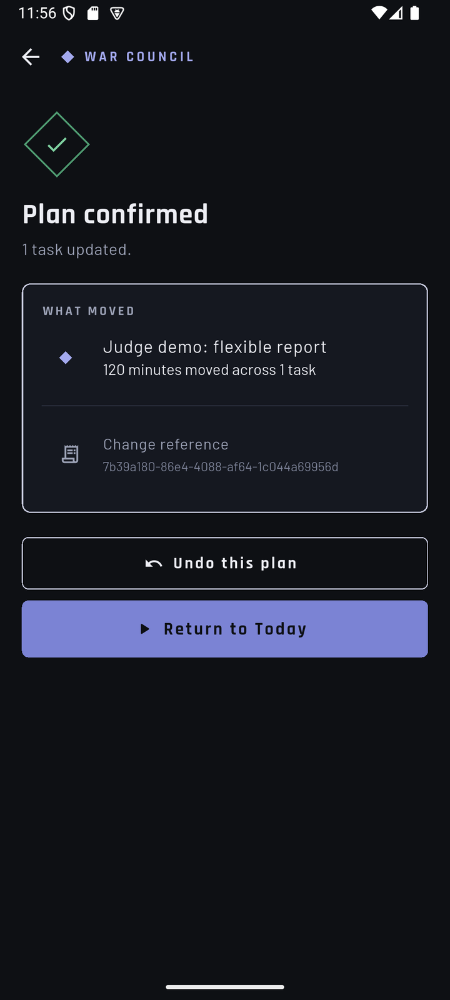

6. Tap **Return to Today** and move to the next day: it now shows the 2 moved hours and still
   fits. The sample day is no longer over capacity.

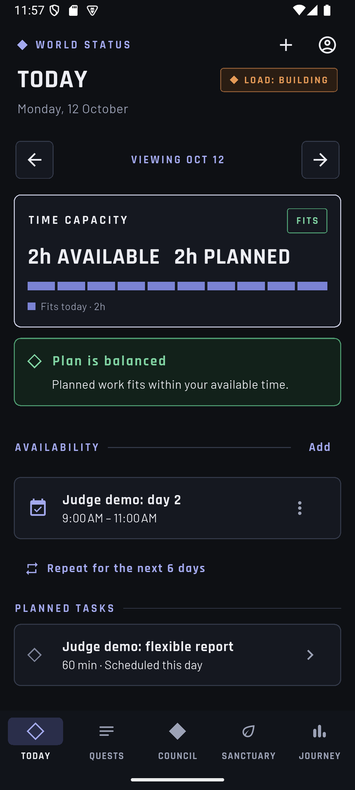

## Step 5 — Undo the plan (COUNCIL → Plan history)

Any confirmed plan can be undone, even after leaving the result screen.

1. Open **COUNCIL** and tap the **Plan history** icon (clock) at the top right.
2. Tap the plan marked **Confirmed**. Its screen shows what moved; tap **Undo this plan**.
3. **Changes were undone** confirms the task was restored. On **TODAY**, the sample day is
   **2H OVER** again and the next day is free.

If the task was edited after the plan was confirmed, Undo is refused with an explanation
instead of overwriting the newer change.

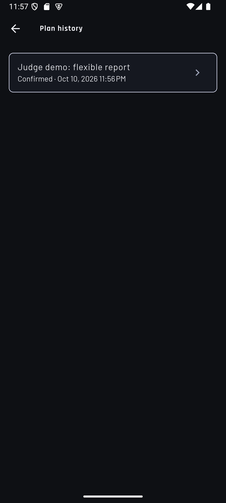  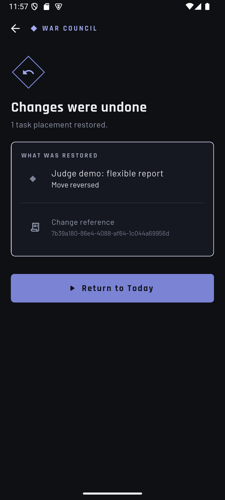

**Please always undo your plan**, so the sample day stays ready for the next judge.

On a day that already fits, Council shows one line instead of options: *No changes needed.
Your plan fits this day.*

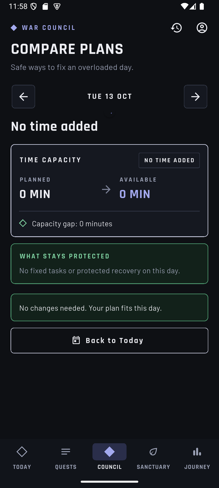

## Step 6 — Protect rest time (SANCTUARY)

Recovery time is optional, and Balance only lets you protect time that is genuinely free.

1. Tap **SANCTUARY**. The page is **RECOVERY TIME**. With no slots yet it says *No recovery
   time yet* and offers **Add recovery time** (also the **+** at the top).
2. Tap **Add recovery time**. The form **Protect recovery time** finds free time for you:
   the sample day is fully booked, so it shows **Free on** *(the next day)* with the
   suggestion **9:00 AM – 11:00 AM · 2h free**, already selected as **Start 9:00 AM** and
   **End 9:30 AM**. Tap another suggestion, or tap Start or End to pick a time yourself.
3. **Something to do with it** lists optional ideas (Short walk, Phone-free rest, Sleep
   preparation, Grounding exercise, Reflection prompt, Visit a campus support service,
   Something else). The slot is protected whether or not you choose one.
4. Tap **Save**. The slot appears as **Protected time · TIME RESERVED**.
5. **Please remove it afterwards**: open its **⋮** menu → **Remove** → **Remove**. A slot on the
   next day would use the free time that the Council plan in step 4 needs.

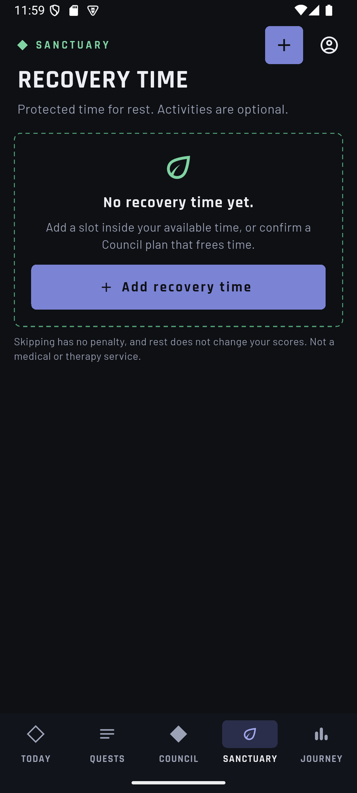 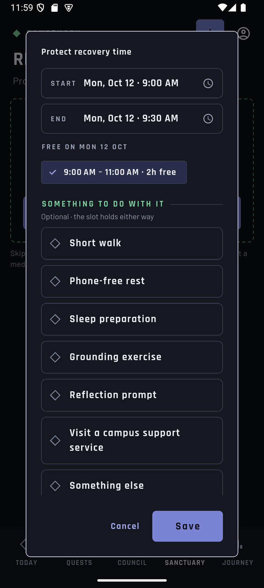

If you choose a time outside the available time, Balance explains why and offers **Go to
Today** or **Choose another time**. Marking an activity done never changes a workload score;
rest is not graded, and skipping it has no penalty.

## Step 7 — Weekly summary and achievement wall (JOURNEY)

1. Tap **JOURNEY**. The page is **WEEKLY REFLECTION**. Use the week arrows to reach the week
   of the sample day.
2. **Weekly pattern** shows the recorded World Status score for each day; days without a
   record show no bar, and past scores are never invented. **Recovery kept** counts days with
   protected recovery.
3. Optional: **Add optional reflection** opens a short private note (*What worked for you
   this week?*). The **My reflections** icon (clock) at the top lists earlier reflections.
4. **Achievements** is a wall of seven badges. Earned badges glow gold with their date;
   locked badges are dimmed with a lock. **Tap a badge** to see how it is earned.
5. Confirming the plan in step 4 can earn **Safe Trade-off** (*Wise Strategist*) and
   **Deadline Safety** (*Deadline Guardian*). A newly earned badge is celebrated once with an
   **ACHIEVEMENT UNLOCKED** animation and a chime. Badges are earned once per account, so some
   may already be unlocked if another judge used the account first.
6. **Team Coordination** stays **Locked**: it needs shared tasks, planned for a later version.

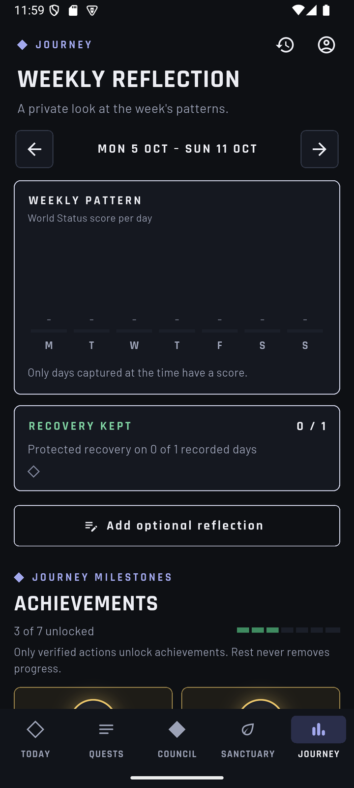 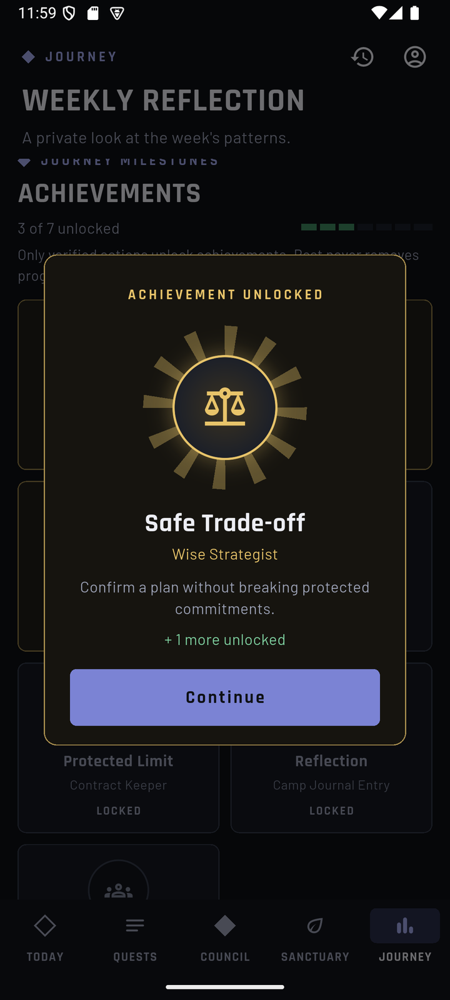 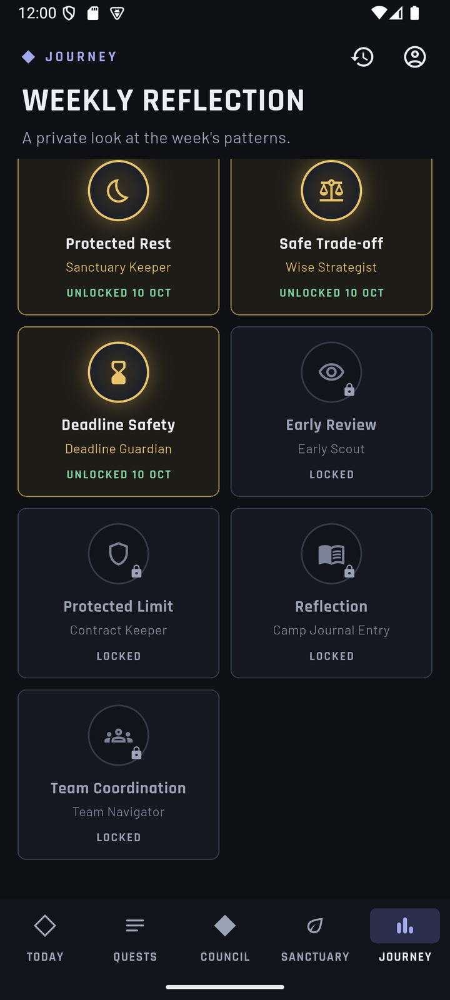 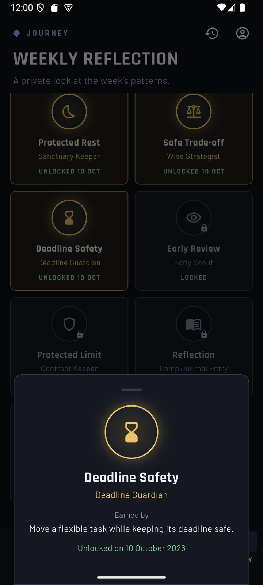

There are no streaks, rankings or penalties for skipping.

## Step 8 — Profile, sound, reminders and alerts (optional)

1. Tap the round **profile icon** at the top right of any main page.
2. **Profile** shows the signed-in account, *Signed in · Changes are saved to your account*,
   the **Planning time zone** (*Asia/Kuala_Lumpur*), a **Plan summary** and the same **World
   Status** score as Today.
3. **How Balance works** reopens the introduction.
4. **Sound effects** (on by default) plays chimes for confirmed plans and new achievements.
   **Relaxing background music** (off by default) plays a calm ambient loop and pauses when
   the app is in the background. All audio is original to Balance.
5. **Reminders and alerts**:
   - **Deadline reminders** — a reminder a set time before each task deadline.
   - **Overload alerts** — a notification the evening before a day with more planned work
     than available time; **Alert time** defaults to 8:00 PM.
   - **Quiet hours** — reminders and alerts are skipped between **Start** and **End**.
   - Both are off by default and ask for notification permission when turned on.
6. **Sign out** ends the session on this phone.

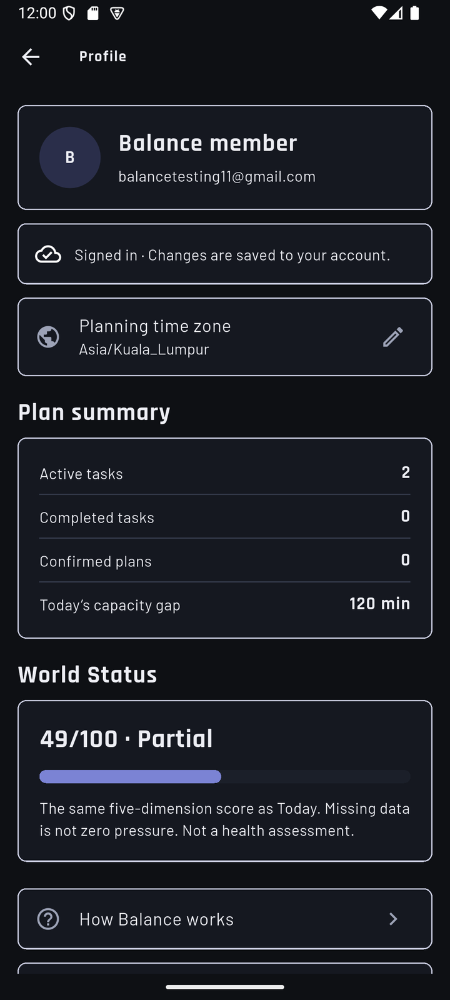 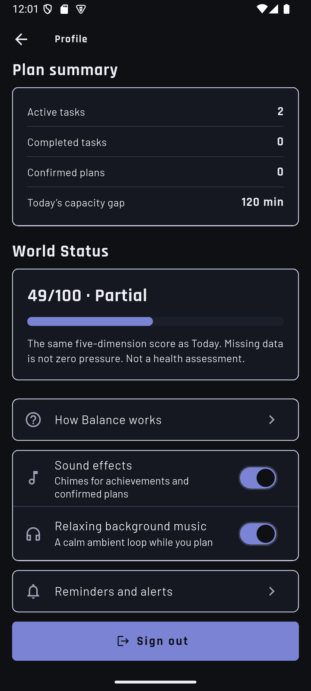 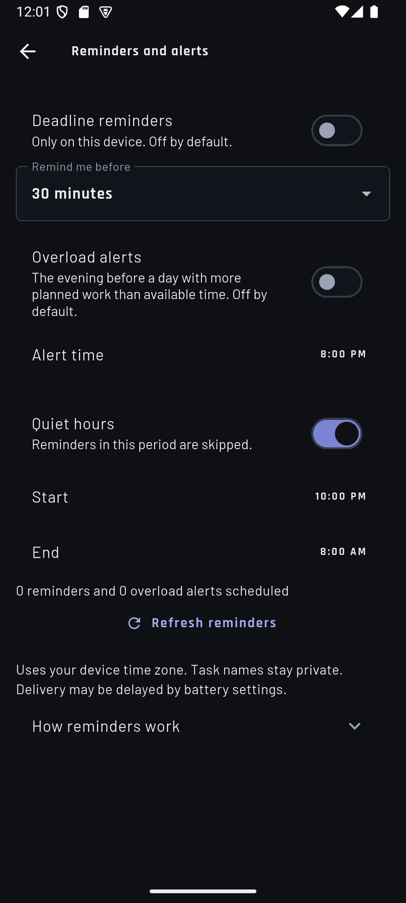

---

# Part B — Page reference

## Bottom bar and header

| Element | What it does |
| --- | --- |
| **TODAY, QUESTS, COUNCIL, SANCTUARY, JOURNEY** | The five main pages. The phone's Back gesture returns to Today, then leaves the app. |
| Eyebrow label (e.g. *WORLD STATUS*) and title (e.g. *TODAY*) | The game-style label and the practical page name. |
| Round profile icon | Opens Profile. |
| Clock icon | *Plan history* on Council; *My reflections* on Journey. |
| **+** | Today: add a time block. Quests: add a task. Sanctuary: add recovery time. |

## TODAY (World Status)

| Element | Meaning |
| --- | --- |
| **LOAD:** Low / Building / High / Over capacity / No data | Summary of the five workload bars (0–24 Low, 25–49 Building, 50–74 High, 75–100 Over capacity). |
| ← *Viewing …* → | Change the day shown. |
| **Time capacity** | Planned vs available time; tag **FITS**, **NO TIME ADDED** or **…H OVER**. |
| **Capacity gap** / **Plan is balanced** | The verdict for the day. |
| *I reviewed this overload* | Appears for an overload with a later deadline; recording it early can earn *Early Review*. |
| **Availability** | Free time blocks; **Add**, **⋮ Edit/Delete**, **Copy from**, **Repeat for the next 6 days**. |
| **Planned tasks** | Work that counts on this day; tap for details. |
| **Workload Overview** | Load total and the five bars, ▲/▼ changes, Calamity trend, *How is this calculated?* |
| **7-day workload trend** | Daily totals for the last seven days once three are recorded. |
| **Optional updates** | Daily Review, Movement, Social. |

## QUESTS (Quest Board)

| Element | Meaning |
| --- | --- |
| Sort icon | Sort tasks (for example *Due soonest*). |
| Search | Filter by title. |
| **Category / Status / Type / Protection** chips | Filters; *Clear filters* resets them. |
| Sections | *Sacred contracts* (protected), *Quests*, *Finished*. |
| Tags | **OVERDUE**, the category (STUDY, ERRAND, SOCIAL, EXERCISE, OTHER), flexibility (FLEXIBLE, FIXED, NEEDS AGREEMENT), **PROTECTED**. An old task without a category shows *Uncategorized · Needs Review*. |
| **⋮** menu | **Mark as done** / **Mark as not done**, **Edit**, **Delete**. Marking an Exercise task done asks whether to record the exercise; *Skip* records nothing. |
| Tap a card | Task details with **Edit task**. |

## COUNCIL (War Council)

| Element | Meaning |
| --- | --- |
| Status tag | **FEASIBLE** (a safe option exists), **NEEDS REVIEW** (information missing), **NEEDS AGREEMENT** (someone else must agree), **NO FEASIBLE PLAN** (no safe move). |
| **What stays protected** | Fixed and protected tasks and protected recovery that will not move. |
| Option card | What moves, where and when; **See trade-offs** shows cost, protection, room created and checks. |
| **Confirm selected plan** | Saves the selected option after the server re-checks it. |
| *No safe move found* | Explains why (for example a task with no start time, or recovery time using the only free time) and offers **Review tasks** or **Add free time on Today**. |
| **Plan history** | Every confirmed plan; open one to **Undo this plan**. |

## SANCTUARY (Recovery time)

| Element | Meaning |
| --- | --- |
| **Add recovery time** | Opens *Protect recovery time* with free-time suggestions. |
| Slot card | *Protected time*, the time, **TIME RESERVED**; **⋮ Edit/Remove**; *Activity done* once it has started. |
| Footer | Skipping has no penalty; rest does not change scores; not a medical service. |

## JOURNEY (Weekly reflection)

| Element | Meaning |
| --- | --- |
| Week arrows | Change the week shown. |
| **Weekly pattern** | Recorded daily scores; no bar means no record. |
| **Recovery kept** | Days with protected recovery out of recorded days. |
| **Add optional reflection** / **My reflections** | Write and read private notes. |
| **Achievements** | Seven badges; tap one for its condition and date. |

## The seven achievements

| Badge | RPG name | Earned by |
| --- | --- | --- |
| Protected Rest | Sanctuary Keeper | Protecting a sleep or recovery slot. |
| Safe Trade-off | Wise Strategist | Confirming a plan without breaking protected commitments. |
| Deadline Safety | Deadline Guardian | Moving a flexible task while keeping its deadline safe. |
| Early Review | Early Scout | Reviewing an overload before the deadline day. |
| Protected Limit | Contract Keeper | Protecting a work shift, family duty or sleep minimum. |
| Reflection | Camp Journal Entry | Saving an optional reflection. |
| Team Coordination | Team Navigator | Marking a shared task as Needs Agreement (later version). |

---

# Part C — Glossary, privacy, troubleshooting and limitations

## Glossary

| Practical name | RPG label | Meaning |
| --- | --- | --- |
| Workload Overview | World Status | Today's capacity, verdict and five workload bars. |
| Tasks and protected commitments | Quest Board, Sacred contracts | Your tasks; protected ones never move. |
| Plan comparison | War Council | Safe ways to fix an overloaded day. |
| Recovery time | Sanctuary | Protected free time for optional rest. |
| Weekly reflection | Journey | Private weekly summary and achievements. |
| Overload alert | Calamity Alert | Optional evening notification before an overloaded day. |
| Unknown | — | No data yet. Never treated as zero. |
| Partial (\*) | — | Some inputs of a score are unknown. |

## Privacy and safety

- Each account sees only its own data; the database enforces this.
- Reflections and the weekly summary are private. There are no rankings or comparisons.
- Notifications use generic wording without task titles.
- Crash reports contain errors only: no screenshots, IP address or email.
- Balance is a planning aid. Its scores describe recorded planning data; it is not a
  medical, diagnostic or mental-health tool.

## If something goes wrong

| What you see | What to do |
| --- | --- |
| "Could not connect" with **Try again** | Check the internet connection, then tap **Try again**. Data already on screen stays visible. |
| The sample day is not 2h over | Check that you are on the sample day. If a plan is still confirmed, undo it in **COUNCIL → Plan history**. |
| Times look several hours off (for example availability at 1:00 AM) | Set the phone to Malaysia time (Settings → System → Date & time → automatic time zone), then reopen Balance. |
| Council shows **No Feasible Plan** on the sample day | A recovery slot is using the next day's free time; the explanation names it. Remove it in **SANCTUARY** (step 6.5). |
| The introduction does not appear | It shows once per phone. Open **Profile → How Balance works**. |
| No sound | Check **Profile → Sound effects** and the phone's media volume. |
| Sign-in fails | Check the email and password from the submission form for typing errors. |
| "Can't install app" | Uninstall any earlier Balance build first, then install again. |

## What Balance does not claim

- Android is the supported platform. iOS has not been tested on a device, and the web build
  is not part of this submission.
- Every task needs a deadline; a "No deadline" option is not available yet.
- Shared tasks and the Team Coordination badge are planned for a later version.
- The app is currently English-only. Bahasa Melayu and Chinese are planned.
